# Message Search & Navigation - Complete Feature Set

## Overview

Ce document centralise toutes les fonctionnalités de recherche et navigation dans les messages de l'application Safe Driving.

## Table des Matières

1. [Recherche Full-Text avec Elasticsearch](#1-recherche-full-text-avec-elasticsearch)
2. [Pagination Bidirectionnelle](#2-pagination-bidirectionnelle)
3. [Jump to Message](#3-jump-to-message)
4. [Sécurité](#4-sécurité)
5. [Performance](#5-performance)

---

## 1. Recherche Full-Text avec Elasticsearch

### Features

- ✅ Recherche dans les messages (contenu + métadonnées)
- ✅ Recherche dans les conversations (nom + description)
- ✅ Recherche dans les utilisateurs (nom + email)
- ✅ Recherche dans les trajets (origine + destination)
- ✅ Edge N-gram analyzer pour correspondance partielle
- ✅ Indexation automatique lors de CREATE/UPDATE/DELETE
- ✅ Filtrage par utilisateur actuel (sécurité)
- ✅ **Calcul de position pour chaque résultat**

### GraphQL Query

```graphql
query SearchMessages(
  $q: String!
  $conversationId: String
  $limit: Int
  $offset: Int
) {
  searchMessages(
    q: $q
    conversationId: $conversationId
    limit: $limit
    offset: $offset
  ) {
    total
    took
    hits {
      _id
      _score
      position # 🆕 Position du message dans la conversation (0-based)
      _source {
        content
        createdAt
        senderId
        conversationId
        rideId
        sender {
          fullName
          phoneNumber
        }
        attachments {
          id
          filename
          mimeType
        }
      }
    }
  }
}
```

### Documentation

Voir [ELASTICSEARCH_MESSAGE_INDEXING.md](./ELASTICSEARCH_MESSAGE_INDEXING.md)

---

## 2. Pagination Bidirectionnelle

### Features

- ✅ Chargement des messages plus anciens (direction: BEFORE)
- ✅ Chargement des messages plus récents (direction: AFTER)
- ✅ Pagination basée sur curseur (createdAt)
- ✅ Cache intelligent (uniquement pour le chargement initial)
- ✅ Fetch-more retourne toujours 20 nouveaux messages (fix du bug de cache)

### GraphQL Query

```graphql
query GetMessages(
  $conversationId: String
  $rideId: String
  $cursor: String
  $limit: Int
  $direction: CursorDirection
) {
  messages(
    conversationId: $conversationId
    rideId: $rideId
    cursor: $cursor
    limit: $limit
    direction: $direction # BEFORE (défaut) ou AFTER
  ) {
    id
    content
    createdAt
    sender {
      id
      fullName
    }
  }
}
```

### Usage Frontend

```typescript
// Chargement initial (avec cache)
const { data } = await fetchMessages({
  conversationId: 'conv-123',
  limit: 20,
  direction: 'BEFORE',
  // pas de cursor = cache activé
});

// Charger plus anciens (sans cache)
const { data: older } = await fetchMessages({
  conversationId: 'conv-123',
  cursor: firstMessage.createdAt,
  limit: 20,
  direction: 'BEFORE',
});

// Charger plus récents (sans cache)
const { data: newer } = await fetchMessages({
  conversationId: 'conv-123',
  cursor: lastMessage.createdAt,
  limit: 20,
  direction: 'AFTER',
});
```

### Documentation

Voir [MESSAGE_PAGINATION.md](./MESSAGE_PAGINATION.md) et [MESSAGE_PAGINATION_FIX.md](./MESSAGE_PAGINATION_FIX.md)

---

## 3. Jump to Message

### Features

- ✅ Navigation directe vers un message spécifique
- ✅ Chargement automatique du contexte (N messages avant/après)
- ✅ Position exacte du message dans la conversation
- ✅ Indicateurs de pagination (hasMoreBefore, hasMoreAfter)
- ✅ Vérification d'autorisation (participant de la conversation)

### GraphQL Query

```graphql
query GetMessagesAroundMessage(
  $messageId: String!
  $beforeCount: Int # Défaut: 10
  $afterCount: Int # Défaut: 10
) {
  messagesAroundMessage(
    messageId: $messageId
    beforeCount: $beforeCount
    afterCount: $afterCount
  ) {
    messages {
      id
      content
      createdAt
      sender {
        id
        fullName
        avatar {
          url
        }
      }
      attachments {
        id
        file {
          url
        }
      }
    }
    targetMessageId # ID du message ciblé
    targetPosition # Position dans la conversation (0-based)
    beforeCount # Nombre de messages chargés avant
    afterCount # Nombre de messages chargés après
    hasMoreBefore # Y a-t-il plus de messages avant?
    hasMoreAfter # Y a-t-il plus de messages après?
  }
}
```

### Workflow Complet

```mermaid
graph TD
    A[User recherche 'rendez-vous'] --> B[searchMessages API]
    B --> C[Affiche résultats avec positions]
    C --> D[User clique sur résultat #148]
    D --> E[messagesAroundMessage API]
    E --> F[Charge messages 128-168]
    F --> G[Scroll vers message #148]
    G --> H[Highlight message temporairement]
    H --> I[User peut paginer normalement]
```



### Documentation

Voir [JUMP_TO_MESSAGE.md](./JUMP_TO_MESSAGE.md)

---

## 4. Sécurité

### Filtrage Automatique par Utilisateur

Toutes les recherches sont **automatiquement filtrées** pour ne retourner que les données accessibles à l'utilisateur actuel :

#### Messages

```typescript
// Filtre: User est participant de la conversation OU du trajet
{
  bool: {
    should: [
      {
        nested: {
          path: 'conversation.participants',
          query: {
            term: { 'conversation.participants.userId': currentUserId },
          },
        },
      },
      {
        nested: {
          path: 'ride.participants',
          query: { term: { 'ride.participants.userId': currentUserId } },
        },
      },
    ];
  }
}
```

#### Conversations

```typescript
// Filtre: User est dans la liste des participants
{
  nested: {
    path: 'participants',
    query: { term: { 'participants.userId': currentUserId } }
  }
}
```

#### Trajets (Rides)

```typescript
// Filtre: User est conducteur OU passager
{
  bool: {
    should: [
      { term: { driverId: currentUserId } },
      { term: { 'passengers.userId': currentUserId } },
    ];
  }
}
```

### Vérifications d'Accès

La méthode `messagesAroundMessage` vérifie que l'utilisateur est participant :

```typescript
const participant = await this.prisma.conversationParticipant.findUnique({
  where: {
    conversationId_userId: {
      conversationId: targetMessage.conversationId,
      userId,
    },
  },
});

if (!participant) {
  throw new Error('Unauthorized');
}
```

### Documentation

Voir [ELASTICSEARCH_SECURITY.md](./ELASTICSEARCH_SECURITY.md)

---

## 5. Performance

### Indexation Automatique

**Impact**: +30-50ms par opération de message

| Operation     | Avant ES | Avec ES | Overhead |
| ------------- | -------- | ------- | -------- |
| sendMessage   | 50ms     | 80ms    | +30ms    |
| editMessage   | 40ms     | 70ms    | +30ms    |
| deleteMessage | 35ms     | 65ms    | +30ms    |

**Justification**: L'overhead est acceptable car :

- Les messages sont immédiatement cherchables (pas de délai)
- `refresh: true` garantit la cohérence
- L'indexation est asynchrone par rapport à la base de données

### Calcul de Position

**Méthode actuelle**: O(N) requêtes COUNT

```typescript
// Pour chaque résultat de recherche
const position = await this.prisma.message.count({
  where: {
    conversationId: messageId,
    createdAt: { lt: target.createdAt },
  },
});
```

**Impact**:

- 10 résultats = 10 COUNT queries
- ~5-10ms par COUNT
- Total: ~50-100ms pour 10 résultats

**Optimisations possibles**:

1. **Cache Redis** (court terme)

   ```typescript
   // Cache position pendant 5 minutes
   await redis.setex(`msg:${id}:pos`, 300, position);
   ```

2. **Window Functions SQL** (moyen terme)

   ```sql
   SELECT id, ROW_NUMBER() OVER (ORDER BY createdAt) - 1 as position
   FROM messages
   WHERE conversationId = ? AND id IN (...)
   ```

3. **Denormalisation** (long terme)
   ```prisma
   model Message {
     positionInConv Int? // Calculé par trigger
   }
   ```

### Cache Strategy

**Règle**: `shouldUseCache = !cursor`

| Scénario                 | Cache  | Raison                               |
| ------------------------ | ------ | ------------------------------------ |
| Chargement initial       | ✅ Oui | Performance, données stables         |
| Fetch-more (avec cursor) | ❌ Non | Garantir données fraîches (20 items) |
| Jump to message          | ❌ Non | Toujours charger contexte actuel     |

### Monitoring

Métriques à suivre :

```typescript
// Logger les performances
this.logger.log({
  action: 'search_messages',
  query: q,
  resultCount: hits.length,
  took: res.took, // Temps Elasticsearch
  positionCalculationTime: posCalcDuration,
  totalDuration: totalDuration,
});
```

---

## Architecture Complète

```
┌─────────────────────────────────────────────────────────────┐
│                        Frontend (React)                      │
├─────────────────────────────────────────────────────────────┤
│  - SearchPanel (recherche full-text)                        │
│  - MessageList (pagination bidirectionnelle)                │
│  - JumpToMessage (navigation depuis recherche)              │
└─────────────────┬───────────────────────────────────────────┘
                  │ GraphQL
                  ▼
┌─────────────────────────────────────────────────────────────┐
│                   GraphQL API (NestJS)                       │
├─────────────────────────────────────────────────────────────┤
│  Resolvers:                                                  │
│  - messages(conversationId, cursor, direction)              │
│  - messagesAroundMessage(messageId, beforeCount, afterCount)│
│  - searchMessages(q, conversationId, limit, offset)         │
└─────────────────┬───────────────────────────────────────────┘
                  │
        ┌─────────┴─────────┐
        ▼                   ▼
┌──────────────────┐  ┌──────────────────┐
│   MessageService │  │ MessageSearch    │
│                  │  │ Service          │
├──────────────────┤  ├──────────────────┤
│ - getMessages    │  │ - searchMessages │
│ - sendMessage    │  │ - indexMessage   │
│ - editMessage    │  │ - deleteMessage  │
│ - deleteMessage  │  │ - calcPosition   │
│ - getMessages    │  └────────┬─────────┘
│   AroundMessage  │           │
└────────┬─────────┘           │
         │                     │
         ▼                     ▼
┌──────────────────┐  ┌──────────────────┐
│   PostgreSQL     │  │  Elasticsearch   │
│   (Prisma)       │  │  (LocalStack)    │
├──────────────────┤  ├──────────────────┤
│ - Messages       │  │ - messages index │
│ - Conversations  │  │ - edge n-gram    │
│ - Participants   │  │ - nested objects │
└──────────────────┘  └──────────────────┘
         │                     │
         └──────────┬──────────┘
                    │ Auto-sync
                    ▼
            ┌──────────────┐
            │     Redis    │
            ├──────────────┤
            │ - Cache (5m) │
            │ - Pub/Sub    │
            └──────────────┘
```

---

## Exemples d'Utilisation Complets

### 1. Recherche Simple

```typescript
const { data } = await client.query({
  query: SEARCH_MESSAGES,
  variables: {
    q: 'rendez-vous',
    conversationId: 'conv-123',
    limit: 10,
  },
});

console.log(`Trouvé ${data.searchMessages.total} messages`);
data.searchMessages.hits.forEach((hit) => {
  console.log(`Message #${hit.position + 1}: ${hit._source.content}`);
});
```

### 2. Recherche + Jump to Message

```typescript
// 1. Rechercher
const searchResult = await searchMessages({ q: 'important' });
const firstHit = searchResult.hits[0];

console.log(`Message trouvé à la position #${firstHit.position + 1}`);

// 2. Naviguer vers le message
const context = await getMessagesAroundMessage({
  messageId: firstHit._id,
  beforeCount: 20,
  afterCount: 20,
});

console.log(`Chargé ${context.messages.length} messages`);
console.log(`Position exacte: #${context.targetPosition + 1}`);
console.log(`Plus de messages avant: ${context.hasMoreBefore}`);
console.log(`Plus de messages après: ${context.hasMoreAfter}`);

// 3. Afficher dans l'UI
setMessages(context.messages);
scrollToMessage(context.targetMessageId);
```

### 3. Pagination Infinie avec Jump

```typescript
function useChatWithJump(conversationId: string) {
  const [messages, setMessages] = useState<Message[]>([]);
  const [mode, setMode] = useState<'normal' | 'jumped'>('normal');

  // Chargement initial
  useEffect(() => {
    loadInitialMessages();
  }, [conversationId]);

  // Charger messages plus anciens
  const loadOlder = async () => {
    const oldest = messages[0];
    const { data } = await fetchMessages({
      conversationId,
      cursor: oldest.createdAt,
      direction: 'BEFORE',
      limit: 20,
    });
    setMessages((prev) => [...data, ...prev]);
  };

  // Jump vers un message
  const jumpToMessage = async (messageId: string) => {
    const { data } = await fetchMessagesAround({
      messageId,
      beforeCount: 20,
      afterCount: 20,
    });

    setMessages(data.messagesAroundMessage.messages);
    setMode('jumped');

    // Scroll vers le message ciblé
    setTimeout(() => {
      scrollToMessage(messageId);
    }, 100);
  };

  return { messages, loadOlder, jumpToMessage, mode };
}
```

---

## Testing

### Tests Unitaires

```typescript
describe('Message Search & Navigation', () => {
  describe('searchMessages', () => {
    it('should return messages with position', async () => {
      const result = await service.searchMessages('test', {
        conversationId: 'conv-1',
      });
      expect(result.hits[0].position).toBeDefined();
    });
  });

  describe('getMessagesAroundMessage', () => {
    it('should load 10 messages before and after', async () => {
      const result = await service.getMessagesAroundMessage(
        'msg-50',
        'user-1',
        10,
        10,
      );
      expect(result.messages).toHaveLength(21); // 10 + 1 + 10
    });
  });
});
```

### Tests E2E

```typescript
describe('Search and Jump Flow', () => {
  it('should search then jump to message', async () => {
    // Rechercher
    const searchResult = await client.query({ query: SEARCH_MESSAGES });
    const hit = searchResult.data.searchMessages.hits[0];

    // Jump
    const jumpResult = await client.query({
      query: MESSAGES_AROUND_MESSAGE,
      variables: { messageId: hit._id },
    });

    // Vérifier
    expect(jumpResult.data.messagesAroundMessage.targetMessageId).toBe(hit._id);
  });
});
```

---

## Roadmap

### Phase 1: Optimisation (Q1 2025)

- [ ] Implémenter cache Redis pour positions
- [ ] Utiliser window functions SQL pour batch calculation
- [ ] Ajouter index sur (conversationId, createdAt, deleted)

### Phase 2: Features Avancées (Q2 2025)

- [ ] Recherche multi-critères (sender, date, type de fichier)
- [ ] Recherche floue (typo tolerance)
- [ ] Highlighting des termes trouvés
- [ ] Prévisualisation du contexte dans les résultats

### Phase 3: Analytics (Q3 2025)

- [ ] Dashboard de métriques d'utilisation
- [ ] A/B test pour optimiser UX
- [ ] Heatmap des positions les plus consultées

---

## Documentation Liée

- [ELASTICSEARCH_MESSAGE_INDEXING.md](./ELASTICSEARCH_MESSAGE_INDEXING.md) - Indexation automatique
- [ELASTICSEARCH_SECURITY.md](./ELASTICSEARCH_SECURITY.md) - Sécurité de la recherche
- [MESSAGE_PAGINATION.md](./MESSAGE_PAGINATION.md) - Pagination bidirectionnelle
- [MESSAGE_PAGINATION_FIX.md](./MESSAGE_PAGINATION_FIX.md) - Fix du bug de cache
- [JUMP_TO_MESSAGE.md](./JUMP_TO_MESSAGE.md) - Jump to message détaillé

---

## Contact

Pour toute question ou suggestion d'amélioration, contactez l'équipe backend.
